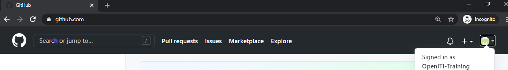
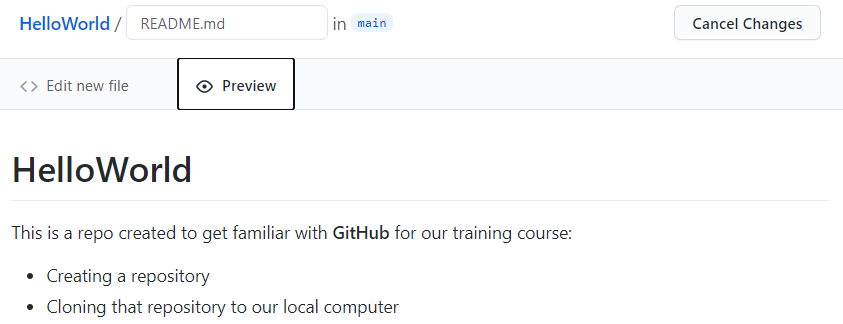
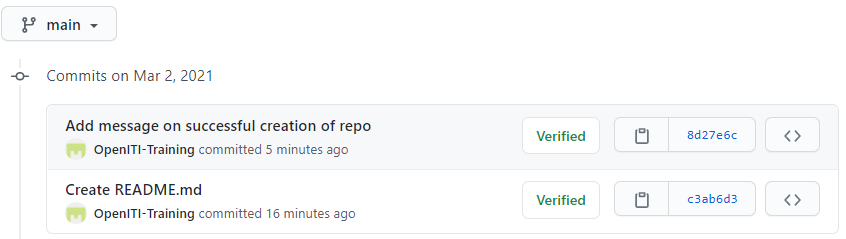

# HelloWorld

This is a repo created to get familiar with **GitHub** for our training course:

* Creating a repository
* Cloning that repository to our local computer

We successfully created our first GitHub repository!

---

## Tutorial

A repository is a folder that contains a git project. You will create a repository
for each project you are starting. 

Go to GitHub.com. 

**If you don't have a GitHub account yet, create one now by 
clicking the `sign up` button and go through the  sign up process.
To finalize the process, you have to click a link sent to the email address
you used to set up the GitHub account**

Log in to your account by clicking the `Sign in` button in the top right of the window. 

Once you're signed in, you'll see an automatically created personal avatar in 
the top right of the window;if you click on it,
you'll see your user name and a couple of links: 

Create a project by clicking the plus sign next to your avatar, and selecting 
"New repository" from the dropdown list: 

Give your repository a new name. It is a tradition in computer programming to 
call your first project "Hello World". GitHub does not allow spaces in repository
names, so let's call ours "HelloWorld". Also add a short description. 

GitHub gives you a couple of additional options: the repository can be either 
public (meaning, anyone on the internet can see it, but you can decide who
can make changes to it) or private (meaning it is invisible, but you can 
invite specific people to view your repo and participate in it). 

GitHub also offers you to create your repository with some files included from 
the start: a README file explaining what this project is about, a .gitignore file
(which describes which files should never be copied when downloading and uploading
to GitHub - more on this later), and a license (which describes how people can
use your project - copyright-wise). 

Let's create the repository without any of these files, and click the green 
"Create Repository" button.

When the repository is created, you arrive at a landing page, which explains 
very shortly what the next steps could be: 

* manually create a new file in the repository
* upload an existing file to the repository
* connect your new repository to a folder on your local computer
* use the command line to add data from an existing folder on your local machine
    to this git repository
* import code from another repository    

We'll use the first option and create a README file: click the "creating a new file"
link in the "Quick setup" section of the landing page:

Give a name to the file: we'll call it `README.md`:

NB: `.md` is the extension for markdown files. 
Markdown is a lightweight markup language that allows you to format a text with 
title headings, bold, italics, etc. using a small amount of special characters. 
See a cheatsheet with an overview of the syntax elements here: 
[https://www.markdownguide.org/cheat-sheet/](https://www.markdownguide.org/cheat-sheet/).

It is a very useful format for writing things for the internet - this tutorial 
was also written in markdown.

Let's write some markdown text in the README.md file:

If you click the Preview button, you can see the effect of the special characters
`#` (first-level header), `**...**` (bold) and `*` (unordered list) is: 

At the bottom of the page (you may have to scroll down) you will find a message
box titled "Commit new file". `Commit` is an important git command: every change
you make in a git repository will be saved with a short descriptive title ("commit message") 
for later reference, so that other users (or yourself) can go through the history
of changes and roll back changes if necessary. 

The commit message is usually a very short message (about 50 characters), 
in the imperative form. You can write it in the smallest of the two input fields.
You will see that GitHub has already provided you with a proposal for your first
commit message: "Create README.md"
You can also add a more extensive description in the larger input field; this
is optional. 

In order to save our changes, we have to click the green "Commit new file" button.

That's it, you have created your first GitHub repository with your first README file, 
and you made your first commit!

If you want to edit the `README.MD` file, you can click the pencil icon:

Don't forget to write a new commit message and click the `Commit new file` button
if you have edited the text of the README file!

You can see the history of our commits by clicking the `History` button under
the green "Code" button:

This will show you all changes (commits) in the repository, from newest to oldest:

